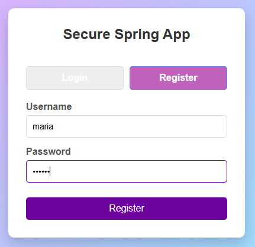
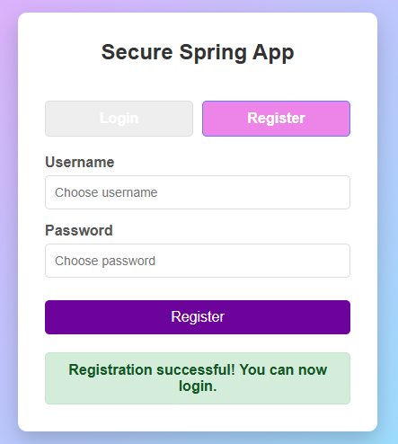
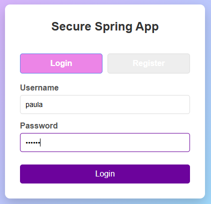
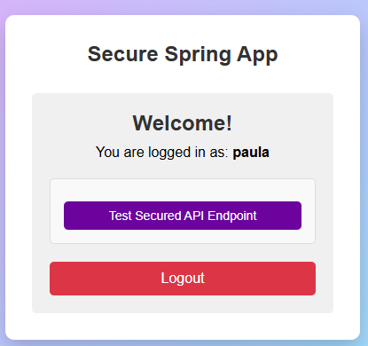
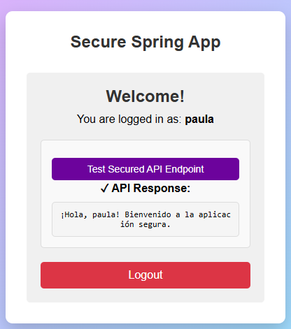
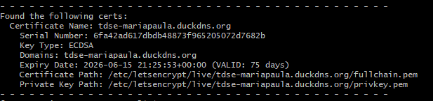

# Secure Spring App – Enterprise Architecture Workshop

Una aplicación web distribuida segura que demuestra buenas prácticas de seguridad usando Spring Boot, Apache, TLS, y despliegue en AWS.


### Desarrollo

**Requisitos Previos:**
- Java 17+
- Maven 3.6+

**Compilar y Ejecutar:**

```bash
# Clonar repositorio
git clone https://github.com/mariapaularm/taller-secure-application-design
cd secure-spring-app

# Compilar con Maven
mvn clean package

# Ejecutar Spring Boot (HTTPS en puerto 5000)
mvn spring-boot:run

# Acceder desde el navegador
https://localhost:5000
# Ignorar advertencia de certificado autofirmado para desarrollo
```

**Usuario de Prueba Predeterminado:**
- Usuario: `testuser`
- Contraseña: `testpass`
- O registrar un nuevo usuario en la aplicación

---

### Descripción General de la Arquitectura

```
┌─────────────────────────────────────────────┐
│  Navegador del Cliente (HTTPS)              │
└────────────────┬────────────────────────────┘
                 │
    ┌────────────┴──────────────┐
    │   Encriptación HTTPS/TLS  │
    │                           │
┌───▼────────────────────┐  ┌──▼──────────────────────┐
│  Servidor Web Apache   │  │ Backend Spring Boot     │
│  (Instancia EC2 1)     │  │ (Instancia EC2 2)       │
│  - Puerto 80 (redir)   │  │ - Puerto 5000 (HTTPS)   │
│  - Puerto 443 (TLS)    │  │ - Comunicación interna  │
│  - Frontend: HTML/JS   │  │ - Base de datos H2      │
└────────────────────────┘  └─────────────────────────┘
```

### Requisitos Previos

- Cuenta de AWS con acceso a EC2
- Nombre de dominio (para certificado Let's Encrypt)
- Par de claves SSH creado en AWS
- Reglas de grupo de seguridad configuradas

### Crear Instancias EC2

#### Instancia 1: Servidor Web Apache

```bash
# 1. Ir a Consola EC2 → Lanzar Instancias
# 2. Seleccionar AMI: Amazon Linux 2023
# 3. Tipo de instancia: t3.micro 
# 4. Configurar:
#    - Número de instancias: 1
#    - VPC: Predeterminado 
#    - IP pública: Habilitar
#    - Almacenamiento: 1 x : 8 GiB: gp3
#    - Etiquetas: Nombre = "apache-web-server"
# 5. Grupo de Seguridad: Crear nuevo o usar existente
#    - Reglas de Entrada:
#      * HTTP (80): 0.0.0.0/0
#      * HTTPS (443): 0.0.0.0/0
#      * SSH (22): Tu IP
#    - Salida: Todo el tráfico
# 6. Revisar y Lanzar
# 7. Usar par de claves existentes 
# 8. Anotar la IP Pública (18.207.94.109)
```

#### Instancia 2: Backend Spring Boot

```bash
# 1. Ir a Consola EC2 → Lanzar Instancias
# 2. Seleccionar AMI: Amazon Linux 2023
# 3. Tipo de instancia: t3.micro 
# 4. Configurar:
#    - Número de instancias: 1
#    - VPC: Mismo que Apache
#    - IP pública: Habilitar (para actualizaciones de SO)
#    - Almacenamiento: 1 x : 8 GiB: gp3
#    - Etiquetas: Nombre = "spring-server"
# 5. Grupo de Seguridad: Crear nuevo
#    - Reglas de Entrada:
#      * SSH (22): Tu IP
#      * TCP personalizado (5000): Grupo de Seguridad de Apache
#    - Salida: Todo el tráfico
# 6. Revisar y Lanzar
# 7. Usar par de claves existentes 
# 8. Anotar la IP Privada (172.31.27.35)
```

### Paso 2: Configurar Servidores

## 4.1 Servidor Apache (Frontend + Proxy)

- Instalar Apache y módulos necesarios:
  - `mod_ssl`
  - `mod_proxy`
  - `mod_rewrite`
  - `mod_headers`
- Copiar el frontend a: `/var/www/secure-spring`
- Configurar host virtual con redirección HTTP → HTTPS
- Configurar proxy hacia el backend Spring Boot
- Instalar certificados TLS con **Let’s Encrypt**

## 4.2 Servidor Spring Boot (Backend)

- Ejecutar Spring Boot con HTTPS en `server.port=5000`
- Configurar `BCryptPasswordEncoder` para encriptar contraseñas
- Implementar endpoints REST seguros:
  - `/api/login`
  - `/api/register`
  - `/api/user`
- Validar sesión y autenticación de usuarios

## Estructura del Repositorio GitHub

```
secure-spring-app/
├── src/
│   ├── main/
│   │   ├── java/com/securespring/
│   │   │   ├── SecureSpring.java           # Aplicación Principal
│   │   │   ├── SecurityConfig.java         # Configuración de Seguridad
│   │   │   ├── AuthController.java         # Login/Registro
│   │   │   ├── HelloController.java        # API REST
│   │   │   ├── User.java                   # Entidad JPA
│   │   │   └── UserRepository.java         # Repositorio JPA
│   │   └── resources/
│   │       ├── application.properties      # Configuración
│   │       ├── static/
│   │       │   └── index.html             # Frontend
│   │       └── keystore/
│   │           └── ecikeystore.p12        # Cert autofirmado
│   └── test/
├── pom.xml                                 # Configuración Maven
├── README.md                               # Este archivo
├── ARCHITECTURE.md                         # Documento de arquitectura
├── SECURITY.md                             # Detalles de seguridad
└── apache-config/
    └── secure-spring.conf                  # Configuración de Apache
```
---

## Evidencias
### Registro de usuario



### Login y acceso a API




### Certificados TLS instalados

